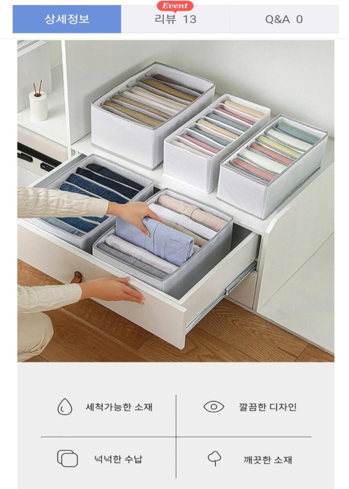
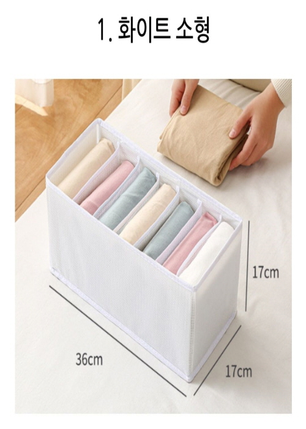
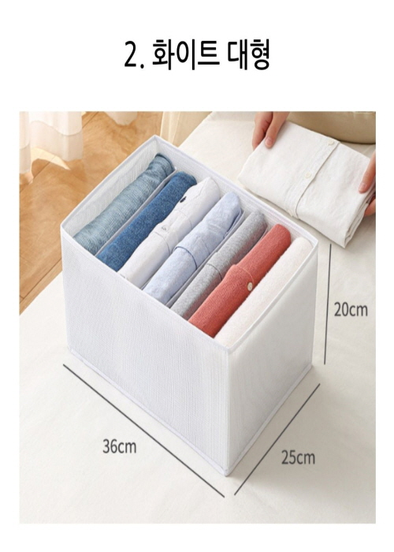

## 네이버 스마트스토어 운영 경험

 영업 직무를 통해 쌓은 능력을 발휘해보고 싶어 2022년 1월부터 6월까지 네이버 스마트스토어를 운영해본 경험이 있습니다. 도매업체에서 상품을 선정하고 판매하는 위탁판매부터 시작하여 직접 물건을 사입하는 단계까지 경험하며 SA, DA 등을 통해 수익을 극대화했습니다.

## 타깃 마케팅을 통한 수익창출

 위탁판매를 할 당시 인기가 많았던 칸칸이정리함 상품을 중국에서 직접 사입하여 판매를 한 경험이 있습니다. 제품 선정부터 수입, 포장, 판매까지 경험하며 셀러의 입장에서 전반적인 B2C 프로세스를 배울 수 있었습니다. 또한 타겟층인 3040 여성 공략을 위한 블로그 광고, 커뮤니티 마케팅 등을 경험하였습니다.

