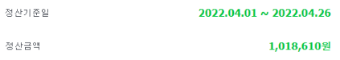

## 위탁판매 성과

역지사지로 경험해야 정확히 알 수 있다고 생각합니다. 플랫폼 업계를 알기 위해 2022년 1월에 네이버 스마트스토어를 시작했습니다. 도매업체에서 제품을 선정하는 단계부터 홍보, 판매까지 하는 위탁판매를 하였고 4월에는 스마트스토어를 통해 순수익 100만원을 달성했습니다.

 

[네이버 스마트스토어](https://smartstore.naver.com/an2392)

## 사입을 통한 수익창출

위탁판매를 할 당시 인기가 많았던 칸칸이정리함 제품을 중국에서 직접 사입하여 판매를 한 경험이 있습니다. 제품 선정부터 수입, 포장, 판매까지 경험하며 셀러의 입장에서 전반적인 이커머스 프로세스를 배울 수 있었습니다. 

![[크기변환]123Screenshot_20220620-005226_NAVER](../images/2021-03-21-firs2t/[크기변환]123Screenshot_20220620-005226_NAVER-16556541945915.jpg)

![[크기변환]12320220526_182931 (1)](../images/2021-03-21-firs2t/[크기변환]12320220526_182931 (1).jpg)

![[크기변환]12320220517_213217](../images/2021-03-21-firs2t/[크기변환]12320220517_213217.jpg)

