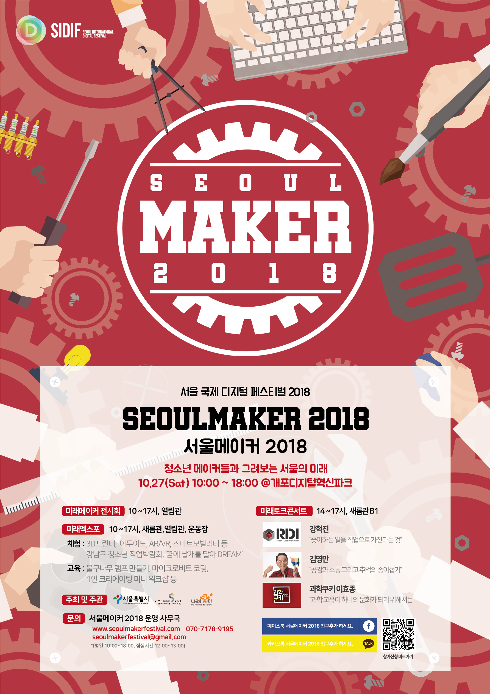
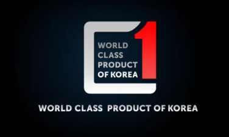

## 프로필

​                                                                  

**이름** : 김경섭

**생년월일** : 1993.10.24

**연락처** : 010-3170-1702

**이메일**: dc_card@naver.com

[경력기술서](https://drive.google.com/file/d/124FCgT5lgXNnYVUbKS6dUNpT0D3bl4SJ/view?usp=sharing){: .btn .btn--info}

## B2B 세일즈 전문가

 2018년 12월부터 오뚜기에서 3년간 영업사원으로 근무하며 영업전략을 수립하고 매출 증대에 기여하였습니다.

 대형 할인점을 관리하며 매대 확보 및 행사 진행을 통해 월평균 매출을 33% 상승시킨 경험이 있습니다. 백화점 식품관 매대를 개선하여 신규제품을 80개 이상 입점시킨 적도 있습니다.

 오뚜기에서 근무하며 거래처와의 커뮤니케이션 능력, 시장분석 능력을 키웠습니다. 또한, 신규제품 행사 유치, 신규 거래처 개척 등의 경험도 하였습니다. B2B 세일즈 전문가라고 자부할 수 있습니다. 

## B2B 세일즈 전문가에서 마케팅 전문가로

 직접 시장에 뛰어들어 영업 관리 직무를 통해 쌓은 능력을 발휘해보고 싶었습니다.

 2022년 1월부터 네이버 스마트스토어를 운영하며 셀러의 입장에서 위탁판매부터 사입까지 진행하였습니다. 이를 통해 블로그 마케팅, 네이버 광고, 상세페이지 문구 작성 등을 해보며 전반적인 마케팅에 대해 경험하였습니다. B2B, B2C 마케팅의 차이를 배울 수 있었고 고객에 따른 맞춤 전략 수립 능력을 키웠습니다.

## 정부 사업 관련 업무 경험

 2018년 6월부터 사회적기업에서 인턴을 하며 서울디지털재단에서 주관하는 <서울메이커 2018> 행사 사업 입찰을 위한 사업계획서 작성부터 행사 기획까지 경험하였습니다.

 또한, 2018년 9월부터 KOTRA에서 인턴을 하며 <2018세계일류상품 육성사업>업체 선정 작업과 인증서 수여식 기획 및 진행을 해본 경험이 있습니다.

